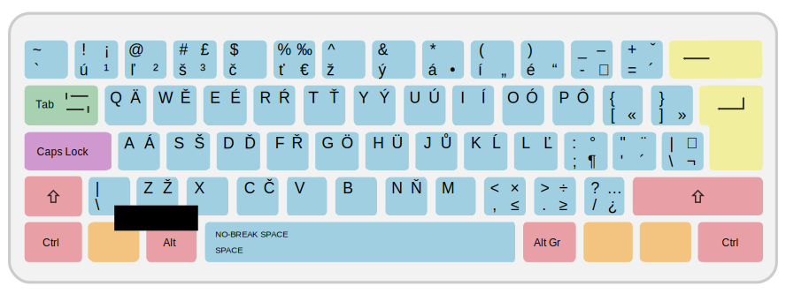

# SK-Prog-Keyboard

Slovak programming keyboard layout

Download installation files https://github.com/jergusg/SK-Prog-Keyboard/releases

<<<<<<< HEAD
### Slovak (Prog)

### Slovak (Prog-Numpad)

=======

>>>>>>> ae63f4c3b1de9ab856625f51ff50f74683c4af78

Keyboard layout for comfortably writing both Slovak and code.

1st and 2nd level keys are the same as the standard US keyboard layout. 3rd and 4th level keys are for writing Slovak letters and other special characters. 3rd level is entered using `Alt Gr` and 4th level using `Shift + Alt Gr`. I recommend mapping also `Caps Lock` as `Alt Gr`.

> ***„***  
> ***This keyboard layout truly changed my life!***  
> ***“***  

### Thanks to and inspired by
*Polish programmers layout*, *Tomi Belan's Slovak (AltGr) keyboard layout* and *US-International keyboard layout*

## Windows
Created using *Microsoft Keyboard Layout Creator 1.4*.

Unzip and run `setup.exe`. May require reboot. You can set the layout through windows settings.

`Caps Lock` can be easily mapped to `Alt Gr` using [SharpKeys](https://github.com/randyrants/sharpkeys/releases) software.

## Android
Works with [External Keyboard Helper](http://www.apedroid.com/android-applications/external-keyboard-helper).

The application needs *Storage permissions* enabled from android settings.  
<<<<<<< HEAD
Copy `ekh_backup.dat` to `Internal storage` root. In the application *EKH Settings*: **Choose keyboard layout > Custom 1 (or Custom 2)**. Then in the application: **Advanced settings > Keyboard mapping > Customize keyboard mappings > ⋮ (settings) > Restore**.
=======
Copy `ekh_backup.dat` to `Internal storage` root. In the application *EKH Settings*: **Choose keyboard layout > Custom 1 (or Custom 2)**. Then in the application: **Advanced settings > Keyboard mapping > Customize keyboard mappings > ⋮ (settings) > Restore**.
>>>>>>> ae63f4c3b1de9ab856625f51ff50f74683c4af78
