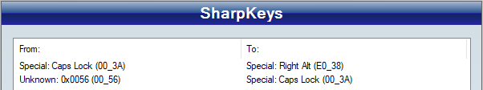

# SK-Prog-Keyboard

Slovak programming keyboard layout. For convenient writing both Slovak and Code.

Download installation files https://github.com/jergusg/SK-Prog-Keyboard/releases

## Slovak - Prog

*Slovak - Prog* is standard English (US) keyboard layout with added 3rd and 4th level for Slovak letters and special symbols.

## What are levels?
It simply means holding modifier key `Shift` or `AltGr` while pressing a normal key. Best illustrated with the picture:

In addition to `AltGr`, I encourge you to create a new 3rd level modifier key on the left side of keyboard so writing is balanced for both hands. I recommed mapping `CapsLock` for this purpouse, as it is not often used nowadays and there are also software alternatives for its function. Another option is mapping this strange `backslash key` next to Left Shift to `AltGr`. Or you can move `CapsLock` to this `backslash key`.

## Windows
Unzip and run `setup.exe`, reboot. You can set the layout through windows settings.

`CapsLock` can be easily mapped to `AltGr` using [SharpKeys software](https://github.com/randyrants/sharpkeys/releases).

Install and run SharpKeys. Press *Add* to add new key mapping. Then select or type corresponding keys (Right Alt needs to be selected).

Example:

First line is mapping `CapsLock` to `AltGr`.  
Second line is mapping `backslash key` (key next to Left Shift) to `CapsLock`.

Press *Write to Registry* and reboot. Mapping can be removed any time later.

## macOS
Use installer `slovak-prog.dmg` to install keyboard layout to system.

If you want to install for current user only, then unzip and copy `slovak-prog.bundle` to `"~/Library/Keyboard Layouts"`

On macOS right and left `alt (option)` keys are the same. `CapsLock` can be also changed to `alt (option)` in *Keyboard Preferences* (Modifier Keys).

## Linux

Unzip and run installer python script with superuser priviledges:

`sudo python3 install-sk-prog.py`

Then reboot.

The script inserts SK-Prog layout from `sk-prog` file into `/usr/share/X11/xkb/symbols/sk` file, where Slovak layouts are located. It also adds entry to `/usr/share/X11/xkb/rules/evdev.xml` for system to register the new layout.

Mapping `CapsLock` to `AltGr` is diffrent in every linux desktop environment. If you have GNOME use *GNOME Tweak Tool*. KDE has this option somewhere in settings. On Ubuntu (Unity) it is: *System Settings* > *Keyboard* > *Shortcuts* > *Typing* > *Alternative Characters Key*. Or you can search google for the right command, such as:  
`dconf write /org/gnome/desktop/input-sources/xkb-options "['lv3:caps_switch']"`.

## Android
Works with [External Keyboard Helper](http://www.apedroid.com/android-applications/external-keyboard-helper).

The application needs *Storage permissions* enabled from android settings.  
Copy `ekh_backup.dat` to `Internal storage` root. In the application *EKH Settings*: *Choose keyboard layout > Custom 1 (or Custom 2)*. Then in the application: *Advanced settings* > *Keyboard mapping* > *Customize keyboard mappings* > ⋮ (*settings*) > *Restore*.

## Acknowledgements

### Thanks to and inspired by
 *Tomi Belan's Slovak (AltGr) keyboard layout*, *Polish programmers layout*, *US-International keyboard layout*

Windows version was created using *Microsoft Keyboard Layout Creator 1.4*

macOS version was created using *Ukelele*